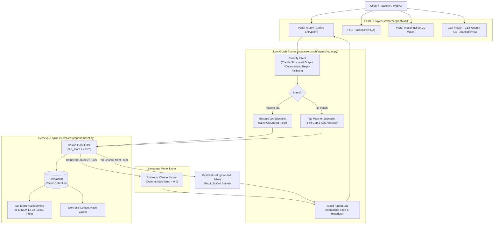

# CareerGraph

[](https://www.python.org/)
[](https://fastapi.tiangolo.com)
[](https://langchain-ai.github.io/langgraph/)
[](https://www.trychroma.com/)
[](LICENSE)

A production-grade, multi-agent RAG backend that turns a professional profile into an interactive, grounded AI knowledge graph. It answers recruiter and technical questions strictly from verified experience, evaluates job descriptions for missing competencies, and computes ATS keyword alignment.

The guiding architectural principle: **Grounding over Hallucination, Control Flow over Prompt Bloat**.

```bash
$ curl -s -X POST http://localhost:8080/query \
  -H "Content-Type: application/json" \
  -d '{"query": "Does Mihul have production experience with distributed vector stores?"}' | jq
{
  "intent": "resume_qa",
  "classification_method": "heuristic",
  "answer": {
    "answer": "Yes. Mihul deployed embedded and client-server ChromaDB architectures with SHA-256 chunk deduplication and cosine-similarity retrieval floors in CareerGraph.",
    "grounded": true,
    "confidence": 0.94,
    "citations": [
      {
        "id": "projects::careergraph::0",
        "title": "CareerGraph - Multi-Agent RAG System",
        "section": "projects"
      }
    ]
  }
}
```

---

## 🏛️ Architecture & System Design

Rather than throwing complex queries into a single overloaded LLM prompt, **CareerGraph** employs a compiled **LangGraph `StateGraph`** with typed state dictionaries and discrete specialized agents.



---

## ⚡ Core Engineering Tenets

### 1. Grounding Over Hallucination (Refusal is a First-Class Feature)
In typical naive RAG implementations, models fabricate answers when query context is sparse. In CareerGraph:
- Retrieved chunks below a cosine-similarity floor (`RETRIEVAL_MIN_SCORE = 0.25`) are discarded immediately.
- If no chunks pass the floor, **the language model is never called**. The API immediately returns HTTP 200 with `grounded: false` and a polite refusal.
- Saves API token cost, eliminates hallucination risks, and preserves recruiter trust.

### 2. Declared Control Flow via LangGraph
Instead of messy `if/else` logic scattered across request handlers, the control flow is a pure LangGraph graph:
- **`START -> classify -> (resume_qa | jd_match) -> END`**
- Intent classification uses structured model output with a **deterministic heuristic fallback** (regular expressions for JD keywords like "requirements", "responsibilities", "qualifications").
- CI test suites run without API keys using the heuristic path without touching external services.

### 3. SHA-256 Content-Hashed Embedding Cache
- Every profile chunk calculates an immutable `content_hash = SHA256(text)`.
- Re-running ingestion skips unchanged text chunks, avoiding redundant matrix multiplications and re-indexing.

### 4. Zero-Overhead Lifespan Composition Root
- FastAPI's `lifespan` pattern instantiates the sentence-transformer weights, ChromaDB connection, and LangGraph compiler once at startup.
- Avoids reloading ~90MB model weights on incoming requests while isolating dependency injection (`Depends(get_app)`) so tests can substitute mocks seamlessly.

### 5. Explicit HTTP Error Semantics
- **`409 Conflict`**: Returned if queries hit an unindexed ChromaDB collection (guides operators to run ingestion rather than guessing why the model is silent).
- **`503 Service Unavailable`**: Returned on upstream LLM API limits/timeouts (allows client-side exponential backoff retries).
- **`422 Unprocessable Entity`**: Sanitized validation failures via Pydantic schemas.

---

## 🚀 Quick Start

### 1. Installation

```bash
# Clone the repository
git clone https://github.com/mihulbairagi/CareerGraph.git
cd CareerGraph

# Create and activate virtual environment
python -m venv .venv
source .venv/bin/activate  # On Windows: .venv\Scripts\activate

# Install package with dependencies
pip install -e ".[dev]"
```

### 2. Environment Setup

Copy `.env.example` to `.env`:

```bash
cp .env.example .env
```

Set your configuration:
```ini
ANTHROPIC_API_KEY=your_key_here
ANTHROPIC_MODEL=claude-sonnet-4-6
EMBEDDING_MODEL=sentence-transformers/all-MiniLM-L6-v2
CHROMA_MODE=persistent
RETRIEVAL_MIN_SCORE=0.25
```

### 3. Ingest Profile Data

Index your resume/profile JSON into ChromaDB:

```bash
careergraph-ingest --profile data/profile.json
```

### 4. Run the API

```bash
uvicorn careergraph.api.app:app --host 0.0.0.0 --port 8080 --reload
```

Interactive OpenAPI Swagger documentation will be available at `http://localhost:8080/docs`.

---

## 📡 API Reference

| Method | Endpoint | Description |
| :--- | :--- | :--- |
| `POST` | `/query` | **Unified Entrypoint**: Auto-classifies query into QA or JD matching. |
| `POST` | `/ask` | **Resume Q&A**: Answers strictly grounded technical questions. |
| `POST` | `/match` | **JD Matcher**: Analyzes job descriptions, returns score + missing skills. |
| `GET` | `/health` | Returns health status (`ok` or `degraded`), vector counts & model info. |
| `GET` | `/search` | Raw cosine-similarity chunk search over indexed sections. |
| `GET` | `/route/preview` | Preview intent routing without invoking language models. |

---

## 🧪 Testing & Code Quality

The entire suite is architected to run deterministic tests without incurring API costs:

```bash
# Run unit and integration tests
pytest

# Code formatting and lint checks
ruff check .
ruff format --check .
```

---

## 🛠️ Tech Stack

- **Framework**: FastAPI (Async HTTP, Pydantic v2 schemas)
- **Agent Orchestration**: LangGraph (StateGraph, typed state dicts)
- **Vector Database**: ChromaDB (Embedded persistent storage)
- **Embeddings**: `sentence-transformers/all-MiniLM-L6-v2` (Local inference, 0 API cost)
- **Inference**: Anthropic Claude Sonnet (Zero temperature for deterministic outputs)
- **Code Quality**: Ruff, Pytest, Pytest-Asyncio

---

## 📄 License

MIT © [Mihul Bairagi](https://github.com/mihulbairagi)
